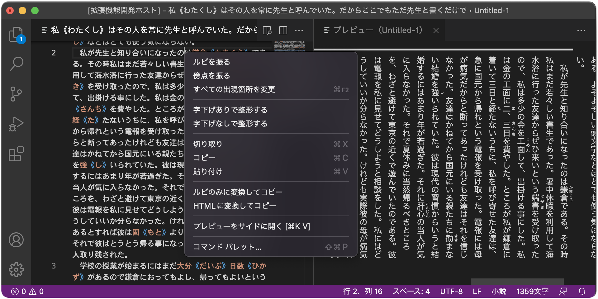

# 小説 for Visual Studio Code

Visual Studio Codeで日本語の小説を書くための拡張機能です。

**※現在はプレビュー版としての公開となっており、仕様は今後大きく変更される可能性があります。**



機能としては小説投稿サイトにあるような、

- ルビや傍点を振る
- 行頭の字下げを揃える
- 字数のカウント
- プレビュー

といったものを一通り備えています。

```txt
｜テキスト《ルビ》
漢字《かんじ》
《《傍点》》
```

ルビや傍点の記法には[カクヨムと同じもの]を採用しており、傍点に対応していないサイトへ投稿する際は「ルビのみに変換してコピー」（傍点は中黒のルビで表現）することが可能です。

[カクヨムと同じもの]: https://kakuyomu.jp/help/entry/notation

## ファイルの種類と対応している機能

| 拡張子 | エディターの言語 | ルビと傍点 | プレビュー | 字数カウント | 字下げ揃え |
| --- | --- | :-: | :-: | :-: | :-: |
| `.txt` | 小説 (`japanese-novel`) | ✅ | ✅ | ✅ | ✅ |
| `.md` | Markdown (`markdown`) | ✅ | ✅ | - | - |

拡張子とエディターの言語の対応づけはVS Codeの設定で変更することが可能です。

## カスタマイズ

プレビューについては設定からフォント、文字サイズ、行の高さを簡単に変更できるほか、カスタムCSSを追加することもできます。

```html
<div class="preview-container">
<p>　文章。</p>
<p><ruby>漢字<rt>かんじ</rt></ruby></p>
<p><em><span>傍</span><span>点</span></em></p>
<p class="preview-selected">エディターで選択されている段落</P>
<p><br></P>
</div>
```

```css
:root {
   /* 設定で変更されている場合のみ追加されます。 */
   --preview-font-family; /* 設定された値 */ ;
   --preview-font-size:   /* 設定された値 */ ;
   --preview-line-height: /* 設定された値 */ ;
}
```

デフォルトのスタイルのほか、このようなHTML/CSSが読み込まれると想定してスタイルを作成してください（ただし仕様は今後変更される可能性があります）。

なお、MarkdownのプレビューについてははVS Code組み込みのMarkdown拡張機能が使われています。Markdownのプレビューの設定からカスタマイズしてください。

## ライセンス

- MIT License
   ([LICENSE-MIT](LICENSE-MIT) or http://opensource.org/licenses/MIT)
- Apache License, Version 2.0
   ([LICENSE-APACHE](LICENSE-APACHE) or http://www.apache.org/licenses/LICENSE-2.0)

のデュアルライセンスにて提供されます。お好きな方を選んでお使いください。

## コントリビューション

特段の定めがある場合を除き、本プロジェクトに対し意図的に為されたコントリビューションの成果は、Apache-2.0ライセンスで定められている通り、追加の条件や条項なしに上記の通りデュアルライセンスされるものとします。
