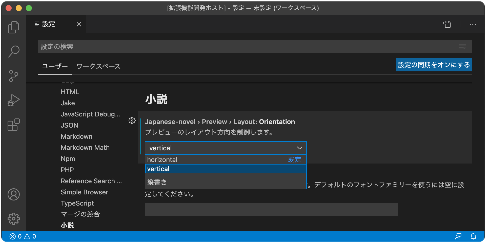
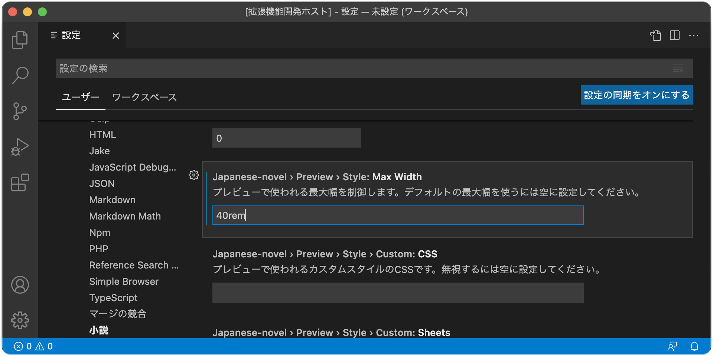

# 小説 for Visual Studio Code

Visual Studio Codeで日本語の小説を書くための拡張機能です。

**※現在はプレビュー版としての公開となっており、仕様は今後大きく変更される可能性があります。**


機能としては小説投稿サイトにあるような、

- ルビや傍点を振る
- 行頭の字下げを揃える
- 字数のカウント
- プレビュー

といったものを一通り備えています。

## 機能一覧

ファイルの種類との対応:

| エディターの言語 | デフォルトの拡張子 | ルビと傍点 | プレビュー | 字数カウント | 字下げ揃え |
| --- | --- | :-: | :-: | :-: | :-: |
| 小説 (`japanese-novel`) | `.txt`　| ✅ | ✅ | ✅ | ✅ |
| Markdown (`markdown`)　| `.md` | ✅ | 横書きのみ | - | - |

各機能は言語がエディターの言語が「小説（`japanese-novel`）」になっているとき有効になります。Markdownへの対応は一部のみとなっています。

### ルビと傍点

```txt
｜テキスト《ルビ》
漢字《かんじ》
《《傍点》》
```

上記のような形式のルビおよび傍点に対応しています。

| コマンドID | コマンド名 |
| --- | --- |
| `"japanese-novel.insertRuby"` | ルビを振る |
| `"japanese-novel.insertDots"` | 傍点を振る |

右クリックで表示されるコンテキストメニューから挿入することができますが、後述のキーバインディングの設定をすることで、キーボードショートカットを使って挿入できるようにもなります。

### プレビュー

テキストファイルのプレビューは設定から縦書きにすることができます。



その際、最大幅を`40rem`のようにフォントサイズと相対的に設定しておくことで、一行の文字数を擬似的に設定することができます。



### 字数カウント

字数は、ルビや傍点の記号、および空白を除いた文字数が、右下のステータスバーに表示されます。

### 字下げ揃え

| コマンドID | コマンド名 |
| --- | --- |
| `"japanese-novel.formatWithIndentation"` | 字下げありで整形する |
| `"japanese-novel.formatWithoutIndentation"` | 字下げなしで整形する |

行頭の字下げ（全角スペース）を「あり」または「なし」で揃えるには、「字下げありで整形する」コマンドまたは「字下げなしで整形する」コマンドを使います。

「あり」で揃える場合、行頭のスペースはすべて一つの全角スペースに置き換えられ、行頭の記号の前のスペースはすべて削除されます。

### テキスト形式の変換

傍点を中黒（`・`）のルビで代替した形式に変換するには「ルビのみに変換してコピー」コマンドを使います。

| コマンドID | コマンド名 |
| --- | --- |
| `"japanese-novel.copyAsRubyOnly"` | ルビのみに変換してコピー |


「小説家になろう」のように傍点記法に対応していないサイトへの投稿する際などにお使いください。

## カスタマイズ

### キーバインディング

VS Codeのキーボードショートカットの設定から、各コマンドにキーボードショートカットを割り当てることも出来ます。

「コマンド」の欄に上記のコマンドIDを入れるだけでも十分ですが、「いつ」の欄に`editorLangId == 'japanese-novel'`を入れるとエディターの言語が「小説」の場合のみに有効になります。

`keybindings.json`

```json
[
    {
        "key": "ctrl+r", // Windows
        "key": "cmd+r", // macOS
        "command": "japanese-novel.insertRuby",
        "when": "editorLangId == 'japanese-novel'"
    },
    {
        "key": "ctrl+d", // Windows
        "key": "cmd+d", // macOS
        "command": "japanese-novel.insertDots",
        "when": "editorLangId == 'japanese-novel'"
    }
]
```

### 拡張子の関連付け

デフォルトでは拡張子が`.txt`のファイルが自動的に小説ファイルとして認識されるようになっています。

VS Codeの設定の`files.associations`（言語に対するファイルの関連付け）を変更すると、例えば、拡張子が`.txt`の場合は普通のプレーンテキストとして認識し、拡張子が`.ja.txt`の場合のみ小説ファイルとして認識させるようにすることも可能です。その場合、次のような項目を追加します（`*`があることに注意）。

| キー | 値 |
| --- | --- |
| `*.txt` | `planetext` |
| `*.ja.txt` | `japanese-novel` |

`settings.json`

```json
{
    "files.associations": {
        "*.txt": "planetext",
        "*.ja.txt": "japanese-novel"
    }
}
```

### プレビューのスタイル

テキストファイルのプレビューについては設定からフォント、文字サイズ、行の高さ、最大幅を簡単に変更できるほか、カスタムCSSを追加することもできます。

```html
<!-- 縦書きの場合は`preview-vertical`↓ -->
<div class="preview-container preview-horizontal">
<p>　文章。</p>
<p><ruby>漢字<rt>かんじ</rt></ruby></p>
<p><em><span>傍</span><span>点</span></em></p>
<p class="preview-selected">エディターで選択されている段落</P>
<p><br></P>
</div>
```

```css
:root {
   /* 設定で変更されている場合のみ追加されます。 */
   --preview-font-family: /* 設定された値 */ ;
   --preview-font-size:   /* 設定された値 */ ;
   --preview-line-height: /* 設定された値 */ ;
   --preview-max-width: /* 設定された値 */ ;
}
```

デフォルトのスタイルのほか、このようなHTML/CSSが読み込まれると想定してスタイルを作成してください（ただし仕様は今後変更される可能性があります）。

なお、MarkdownのプレビューについてはVS Code組み込みのMarkdown拡張機能が使われています。Markdownのプレビューの設定からカスタマイズしてください。

## ライセンス

- MIT License
   ([LICENSE-MIT](LICENSE-MIT) or http://opensource.org/licenses/MIT)
- Apache License, Version 2.0
   ([LICENSE-APACHE](LICENSE-APACHE) or http://www.apache.org/licenses/LICENSE-2.0)

のデュアルライセンスにて提供されます。お好きな方を選んでお使いください。

## コントリビューション

特段の定めがある場合を除き、本プロジェクトに対し意図的に為されたコントリビューションの成果は、Apache-2.0ライセンスで定められている通り、追加の条件や条項なしに上記の通りデュアルライセンスされるものとします。
